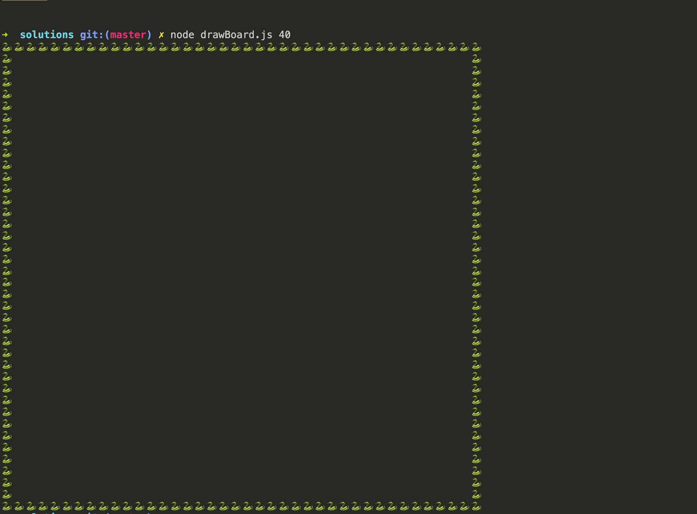

## Tasks

### contains
Create a contains(element, arr) function that has 2 arguments (element: (number|string), arr: (string|number)[]) and returns (boolean), which 
checks if the element is present in the array, otherwise fasle.

```js
const numbers = [1, 69, 420]

const contains = (element, arr) => {}

console.log(contains(69, numbers)) // => true
console.log(contains(666, numbers)) // => false
```

### range
Create a range(from, to) function that has 2 arguments (from: number, to: number) and returns (number[]), which 
creates a range of numbers starting from the `from` number and ends in `to` number.

```js
const range = (from, to) => {}

console.log(range(1, 10)) // => [1, 2, 3, 4, 5, 6, 7, 8, 9, 10]
console.log(range(5, 9)) // => [5, 6, 7, 8, 9]
```

### minMax
Create a minMax(arr) function that has 1 argument (arr: number[]) and returns ([number, number]).
Return an array with the smallest and largest number.

```js
const minMax = (arr) => {}

console.log(minMax([1, 2, 3, 4, 5])) // => [1, 5]
console.log(minMax(1, 1, 1, 1)) // => [1, 1]
```

### without
Create a without(exclude, arr) function that has 2 arguments (exlcude: number[], arr: number[]) and returns (number[]).
Return a new array which is the `arr` with filtered out `exclude` array.

```js
const without = (exclude, arr) => {}

console.log(without([5,6], [1,2,3,4,5,6]); // => [1, 2, 3, 4]
console.log(without([4,7], [1,2,3,4,5,6]); // => [1, 2, 3, 5, 6]
```

### zip
Create a zip(arr1, arr2) function that has 2 arguments (arr1: (string|number)[], arr2: (string|number)[]) and returns ((string|number)[]).
Return a new list, which merges together the values of each of the arrays with the values at the corresponding position.

```js
const zip = (arr1, arr2) => {}

console.log(zip([1, 2, 3], [4, 5, 6])) // => [[1, 4], [2, 5], [3, 6]]
```

### Snake Board
1. Draw a board in the console, like the image below. It should print the snake symbols
in a square/rectangular shape. Try to figure out the name of the function, its parameters and what it returns.


<details>
<summary>
Solution
</summary>
<p>

[solutions/drawBoard.js](solutions/drawBoard.js)
</p>
</details>

### [Map][map], [Filter][filter], [Reduce][reduce]
Implement the three functions, and reimplement the previous tasks with them.

## Use only [Map][map], [Filter][filter] or [Reduce][reduce] for the following tasks:

### doubled
Create a function, which doubles the numbers of an array.

```js
console.log(doubled([1, 2, 3, 4])) // => [1, 4, 6, 8]
console.log(doubled([5, 5])) // => [10, 10]
```

### multiplier
Create a function, which multiplies the numbers of an array by themselves.

```js
console.log(multiplier([1, 2, 3, 4])) // => [1, 4, 9, 16]
console.log(multiplier([5, 5])) // => [25, 25]
```

### lengthifier
Create a function, which transforms elements of an array to their length.

```js
console.log(lengthifier(['dog', 'snake', 'elephant', 'cat'])) // => [3, 5, 7, 3]
```

### filterEven
Create a function, which filters only the even numbers in an array.

```js
console.log(filterEven([2, 3, 9, 10, 12])) // => [2, 10, 12]
```

### filterPalindrome
Create a function, which filters only the palindroms in an array.
- find a helper function, already implemented in javascript to check if a word is a palindrome.

```js
console.log(filterPalindrome(['demigod', 'rewire', 'madam', 'freer', 'anutforajaroftuna', 'kiosk'])) // => ['madam', 'anutforajaroftuna']
```

### sum
Create a function, which sums the numbers in an array.

```js
console.log(sum([1, 2, 3, 4, 5])) // => 15
```

### concat
Create a function, which flattens an array of arrays into a single array.

```js
console.log(flatten([1, 'cat', 3, 4, 5])) // => '1cat345'
```

### flatten
Create a function, which  array.

```js
console.log(flatten(['cat', 'dog'], [true], [4, 5, 6])) // => ['cat', 'dog', true, 4, 5, 6]
```

## Other
Which of the previous exercises can be solved with [Map][map], [Filter][filter], [Reduce][reduce]?

## IMPORTANT
Initially we used `for loop`, and then we learned about `map`, `filter` and `reduce`. From
this point on, we will strive to only you higher order functions like `map`,
`filter`, `reduce` and etc., for a more functional style approach.

[map]: https://developer.mozilla.org/en-US/docs/Web/JavaScript/Reference/Global_Objects/Array/map
[filter]: https://developer.mozilla.org/en-US/docs/Web/JavaScript/Reference/Global_Objects/Array/filter
[reduce]: https://developer.mozilla.org/en-US/docs/Web/JavaScript/Reference/Global_Objects/Array/Reduce
